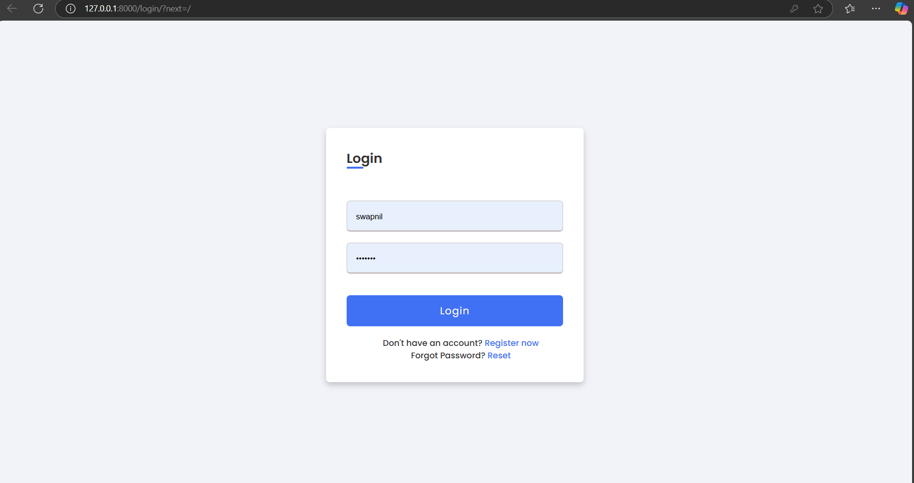
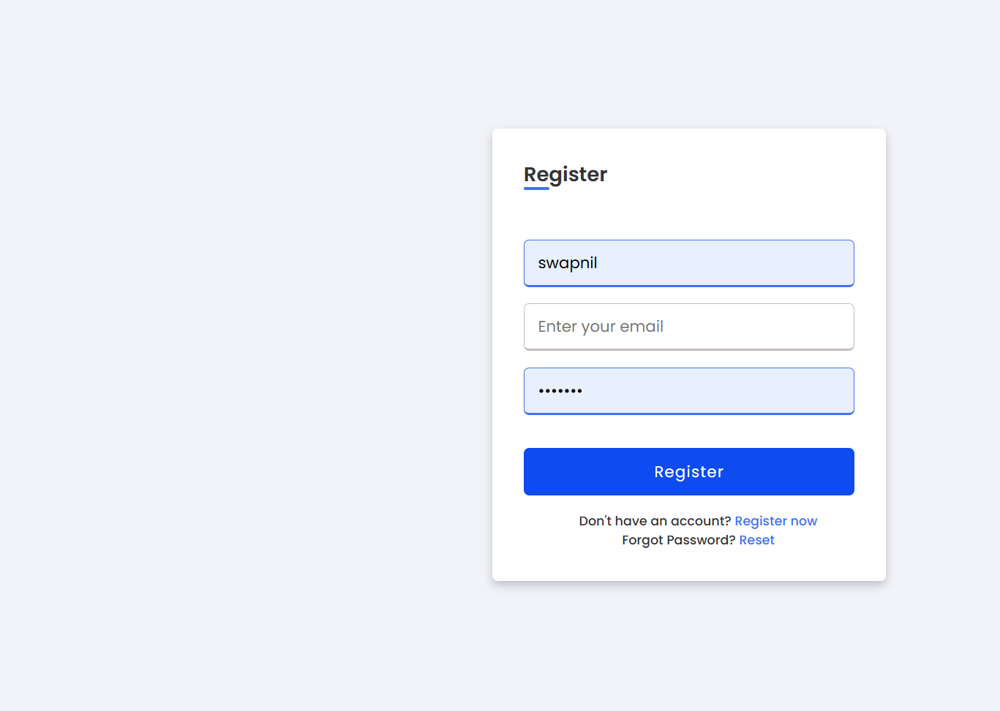
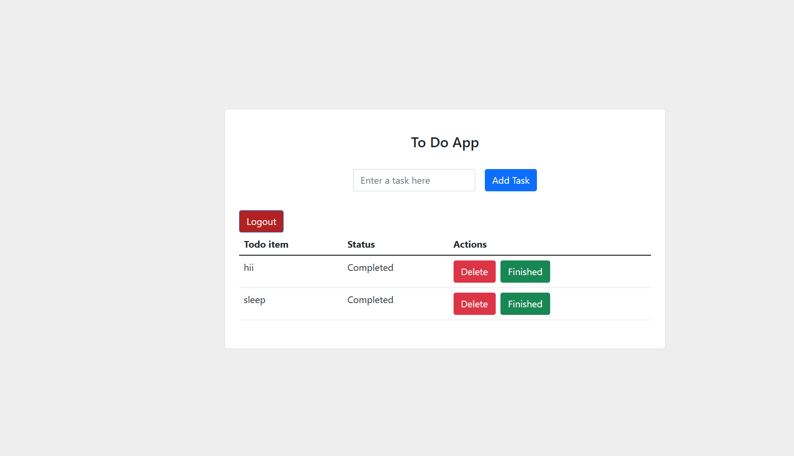

# 📝 Django To-Do App

A simple and elegant to-do application built with Django, featuring user registration, login, task creation, completion, and deletion.

## 🚀 Features

- 🔐 User Authentication (Register, Login, Logout)
- ➕ Add new tasks
- ✅ Mark tasks as complete
- ❌ Delete tasks
- 📊 Simple dashboard to manage tasks
- 💡 Clean and responsive UI

## 📸 Screenshots

### 🔐 Login Page
!

### 🧾 Register Page

### 📋 Dashboard

## 🛠️ Tech Stack

- **Backend**: Django (Python)
- **Frontend**: HTML, CSS (Bootstrap/Tailwind)
- **Database**: SQLite (default for development)

## 📂 Project Structure

